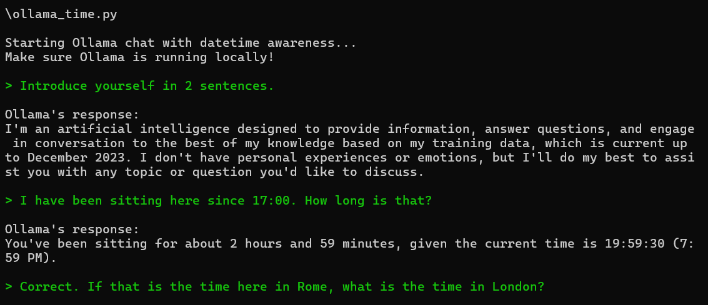

# ollama scripts

### ollama_continuous.py

A simple chat window with different colors for the user and the LLM. As simple as it gets. 

### ollama_time.py

An example of giving ollama local time awareness.

### ollama_persistent.py

An example of interacting with ollama and saving the conversations to disk (using the chat_history.json file) to act as a form of memory. Local time awareness is also included. 